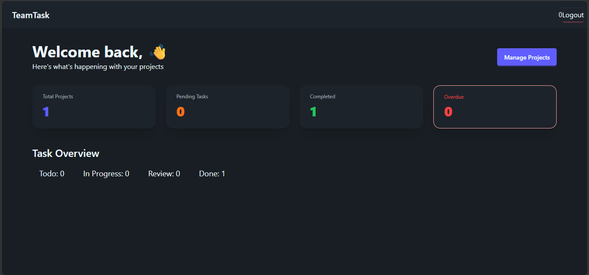
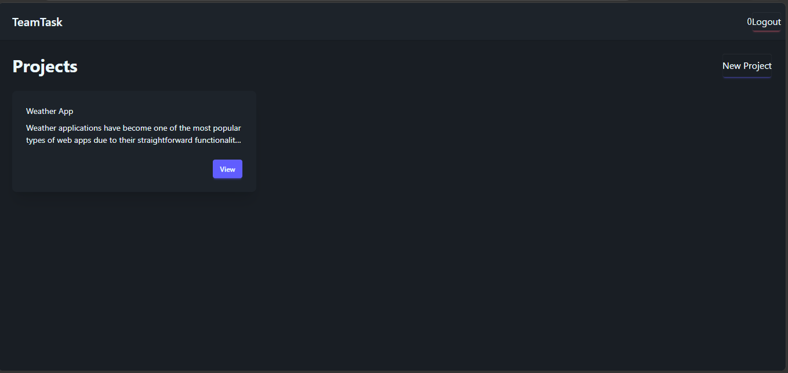
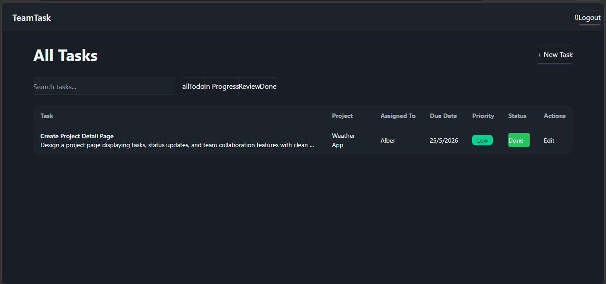
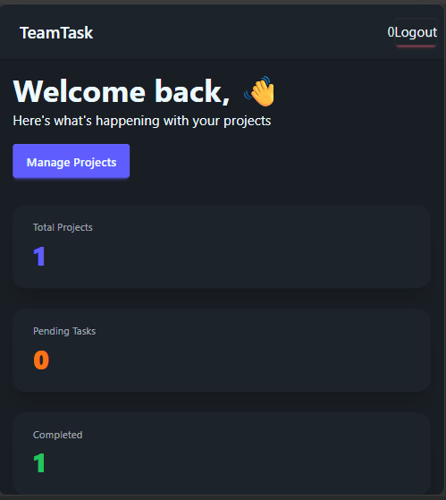

# TeamTask Manager 🚀

A full-stack **Team Task Management** web application with role-based access control (Admin & Member).

Built with **MERN Stack** + modern tools.

---

## ✨ Features

### Authentication
- User Signup & Login
- JWT Authentication
- Password Hashing

### Project Management
- Create, View, Update & Delete Projects
- Add team members to projects
- Role-based access (Admin / Member)

### Task Management
- Create, Assign, Update & Delete Tasks
- Task status tracking (`Todo`, `In Progress`, `Review`, `Done`)
- Priority levels (`Low`, `Medium`, `High`)
- Due dates & overdue highlighting

### Dashboard
- Overview statistics
- Overdue tasks alert
- Task distribution

### Additional
- Fully Responsive Design
- Modern UI with **DaisyUI + Tailwind CSS**
- Redux Toolkit for state management
- Protected Routes

---

## 🛠️ Tech Stack

### Frontend
- **React 18** + **Vite**
- **Redux Toolkit** + React-Redux
- **Tailwind CSS** + **DaisyUI**
- **React Router DOM**
- **React Hook Form**

### Backend
- **Node.js** + **Express.js**
- **MongoDB** (Mongoose ODM)
- **JWT** Authentication
- **Bcrypt.js** for password hashing

---

## 📁 Project Structure

```bash
TeamTaskManager/
├── backend/
│   ├── config/
│   ├── controllers/
│   ├── middleware/
│   ├── models/
│   ├── routes/
│   ├── .env
│   └── server.js
│
├── frontend/
│   ├── src/
│   │   ├── components/
│   │   ├── features/
│   │   ├── pages/
│   │   ├── redux/
│   │   ├── services/
│   │   └── utils/
│   ├── .env
│   └── vite.config.js
│
└── README.md

🚀 Getting Started
Prerequisites

Node.js (v18+)
MongoDB (Local or MongoDB Atlas)

1. Clone the Repository
``
git clone https://github.com/ansarialiakbar/Team_Task_Manager.git
cd TeamTaskManager
```

2. Backend Setup
```
cd backend
npm install
```

Create .env file:
```
envPORT=5000
MONGO_URI=your_mongodb_connection_string
JWT_SECRET=your_super_secret_jwt_key
JWT_EXPIRES_IN=7d
```

Run Backend:
```
npm run dev
```

3. Frontend Setup
```
cd frontend
npm install
```

Create .env file:
```
VITE_API_URL=http://localhost:5000/api
```

Run Frontend:
```
npm run dev
```

## 📌 Available Scripts

Backend:
```
npm run dev → Start with nodemon

npm start → Production
```

Frontend:
```
npm run dev → Development

npm run build → Production build
```


## 🧪 API Testing (Postman)

Register: POST /api/auth/register

Login: POST /api/auth/login

Projects: POST/GET /api/projects

Tasks: POST/GET/PUT/DELETE /api/tasks

All protected routes require Bearer Token in Authorization header.

👥 Roles
```
**Role**          **Permissions**

Admin            Full access + Add members + Assign tasks

Member           View projects/tasks, Update task status
```


## 🖼️ Screenshots

**Dashboard**


**Projects Page**


**Task Management**


Responsive Mobile View



## 🚀 Deployment

### Backend

Render.com 


### Frontend

Netlify


## 👨‍💻 Author

Ali Akbar Ansari

Full-Stack Developer
